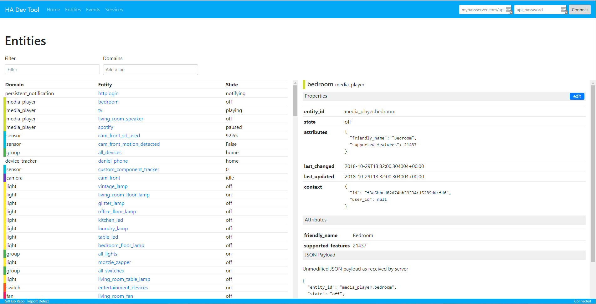
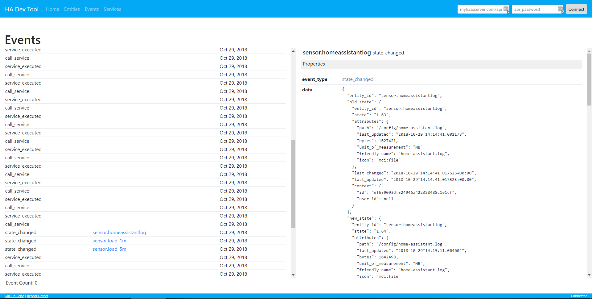
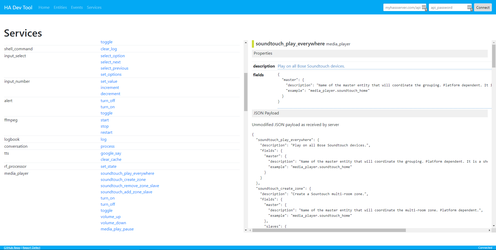

This tool provides a web interface allowing you view Home Assistant API data. The first release includes functionality to view:
* Entities, domains and their states
* Real time Events and event data
* Services and their properties

You can connect to a HA server on your local network or to a external server.

The aim for the tool is to allow you to explore the JSON payloads returned by Home Assistant's API such that you can build your own payloads to use in services such as IFTTT or Dialogflow.

**Entities View**


**Events View**


**Services View**



In the future, you will be able to modify entity states, though there is an open issue blocking the implementation of this feature.

I wrote this tool to aid in the HA integration with third-party services via the REST API. Home Asssistants built-in developer tools do not provide the visibility I was looking for and felt clunky to use. For example, having to write JSON payloads from scratch and losing all progress when navigating to a different tab.


# Access Hosted Version
You can access a hosted version of the app by clicking the link below:
[HA API Tool](https://tool.danielha.tk)

The hosted version runs on the latest production Docker image `danobot/ha-api-tool:latest` available on DockerHub. This image is automatically regenerated as part of the deployment pipeline.

Note that the tool is built in JavaScript and runs locally in your browser. Apart from the initial application download, no data is transferred between my server and your machine. Your login credentials are persisted to your Browser's local storage (for convenient reconnection after page reloads). Other than that, no data is saved.

Once downloaded, the application communicates directly with your Home Assistant server. You are welcome to build and/or run the image yourself. The necessary instructions are below.

# Build your own image
Clone the `master` branch and run:

```
docker build -t ha-api-tool .
```

# Run local Docker container
Clone the repository, or copy and docker-compose.yaml file to your local drive. Then run:

```
docker-compose up -d ha-api-tool
```

# Backlog
See the Github repository for a list of open issues and backlog items. Feel free to submit pull requests.
